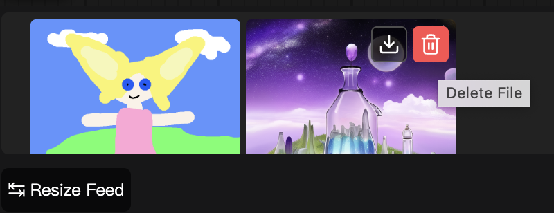

# ComfyUI-Custom-Scripts_extend  
Feature extension package for **[ComfyUI-Custom-Scripts](https://github.com/pythongosssss/ComfyUI-Custom-Scripts)**  

## Preview


## Installation

#### Install the node:
```bash
cd ComfyUI/custom_nodes
git clone https://github.com/lihaoyun6/ComfyUI-Custom-Scripts_extend.git
```
⚠️You must install **[ComfyUI-Custom-Scripts](https://github.com/pythongosssss/ComfyUI-Custom-Scripts)** first to use this extension!

## Features
- Allows users to download or delete images from their disk in the bottom gallery and lightbox viewer.  
- Makes the gallery retain its content after refreshing (the original version would be cleared)  
- Fixed the bug where the <kbd>Show Image Feed🐍</kbd> button in the menu bar wouldn't automatically hide after refreshing.

## Credits
- [ComfyUI](https://github.com/comfyanonymous/ComfyUI) @comfyanonymous
- [ComfyUI-Custom-Scripts](https://github.com/pythongosssss/ComfyUI-Custom-Scripts) @pythongosssss
